## Quick Start Instructions

- Make sure you have Docker desktop running
- In the terminal, run `docker compose up`

## Features Implemented

- User creation and sign up
  - Users can create a username; if the username already exists, an error is displayed
  - Login functions verifies the username exists, but there is no password protection

- Basic authentication
  - Authenticated users can view the task board; unauthenticated users see a landing page

- Task management
  - Users can create tasks with a title, description, and initial status
  - Users can edit task title, description and status
  - Users can delete tasks; all tasks are shared globally

- Real-time Sync
  - Connection status indicator shows whether the socket is connected
  - Changes made by any user are broadcast to all connected clients via WebSocket
  - Opening the app in multiple browser windows Edits to tasks are automatically reflected across all windows

## Tech Stack Choices

### Frontend

- React 19 with TypeScript
- React Router for navigation
- CSS Modules for scoped styling
- Vite handles bundling, dev server, and hot module reload
- Socket.IO Client provides the real-time WebSocket connection
- Jest and React Testing Library

React, TypeScript, React Router, Jest, and React Testing Library are my "daily drivers" -- I've been using most of these for 10ish years, so I chose them because I'm quick and confident; they're also popular, which means that onboarding a teammate to the project should be easy since it's likely they're also familiar with these tools.

Vite is newer to me, but it's also quick to set up and easy to use, which is important when you're facing time constraints.

I haven't used Socket.IO before in production, but I appreciated their clear documentation.

### Backend

- Node.js
- Express 5
- TypeScript
- Socket.IO handles real-time event broadcasting alongside the REST API

As a primarily frontend-focused dev, I really like being able to use JavaScript on the backend. JavaScript is the best :)

### Database

- PostgreSQL

###  Infrastructure

- Docker Compose orchestrates frontend, backend, and Postgres
- Vite dev server proxies /api and /socket.io requests to the backend container
- pnpm for frontend dependencies
- npm for backend dependencies

Docker can be tricky to set up by hand, but AI is a great tool for scaffolding a lot of the boilerplate you need to get an app off the ground.

## System Architecture

1. TaskItem sends changes via fetch PATCH through the Vite proxy to Express
2. Express updates the DB and emits task:updated via Socket.IO to all connected clients
3. TaskBoardView receives the socket event, updates React state, and every connected browser window re-renders

```mermaid
  graph TB
      subgraph Docker["Docker Compose"]

          subgraph Frontend["Frontend Container :5173"]
              Vite["Vite Dev Server<br/>(HMR + Proxy)"]

              subgraph React["React SPA"]
                  App["App<br/>(AuthProvider + Routes)"]

                  App --> HomeView["/&ensp; HomeView"]
                  App --> LoginView["/login&ensp; LoginView"]
                  App --> CreateUserView["/signup&ensp; CreateUserView"]
                  App --> ProtectedRoute["ProtectedRoute"]
                  ProtectedRoute --> TaskBoardView["/taskboard&ensp; TaskBoardView"]

                  TaskBoardView --> TaskForm["TaskForm"]
                  TaskBoardView --> TaskColumnTodo["TaskColumn<br/>To Do"]
                  TaskBoardView --> TaskColumnIP["TaskColumn<br/>In Progress"]
                  TaskBoardView --> TaskColumnDone["TaskColumn<br/>Done"]

                  TaskColumnTodo --> TaskItem["TaskItem(s)"]
                  TaskColumnIP --> TaskItem
                  TaskColumnDone --> TaskItem
              end
          end

          subgraph Backend["Backend Container :3001"]
              Express["Express Server"]

              subgraph REST["REST API"]
                  GET_tasks["GET /api/tasks"]
                  POST_tasks["POST /api/tasks"]
                  PATCH_tasks["PATCH /api/tasks/:id"]
                  DELETE_tasks["DELETE /api/tasks/:id"]
                  GET_user["GET /api/users/:username"]
                  POST_user["POST /api/users"]
              end

              subgraph SocketIO["Socket.IO Server"]
                  direction LR
                  Incoming["Incoming Events<br/>task:add<br/>task:update<br/>task:delete"]
                  Outgoing["Outgoing Events<br/>tasks:initial<br/>task:added<br/>task:updated<br/>task:deleted"]
              end

              Express --- REST
              Express --- SocketIO
              DB_Module["db.ts<br/>getAllTasks · insertTask<br/>updateTask · deleteTask<br/>getUserByUsername · insertUser"]
          end

          subgraph Postgres["PostgreSQL :5432"]
              Tasks[("tasks<br/>id · title · description<br/>status · created_at · updated_at")]
              Users[("users<br/>id · username<br/>created_at · updated_at")]
          end
      end

      Vite -- "/api/* proxy" --> Express
      Vite -- "/socket.io/* proxy (ws)" --> SocketIO

      TaskItem -- "fetch PATCH/DELETE" --> Vite
      TaskForm -- "socket: task:add" --> Vite
      TaskBoardView -. "socket: task:added,<br/>task:updated, task:deleted" .-> Vite

      REST --> DB_Module
      SocketIO --> DB_Module
      DB_Module --> Postgres
```

## Time Log

45 minutes -- Used AI to scaffold the basic app, then followed the recommendation in the instructions to get real-time working early

45 minutes -- Frontend code for the task management

20 minutes -- User management and authentication

20 minutes -- Lightweight clean-up 

30 minutes -- Set up the database

15 minutes -- Basic manual testing

## Key Technical Decisions & Tradeoffs

- Comination of REST endpoints + Socket.IO — Simpler than going full-socket for writes, but it means we need to maintain two parallel communication paths (REST endpoints for mutations and server broadcasts changes to all clients via Socket.IO)
- React Context for auth — chose not to use an external state library for now, but the auth state defaults to true and is lost on refresh
- Server broadcasts to all clients, but doesn't scale horizontally without adding a Redis adapter
- Hardcoded dev credentials in docker-compose.yml — chose speed over being production-safe; no secrets management
- No database migrations; schema changes require manual intervention or container recreation

Generally speaking, I like to get things working before optimizing, and I felt the timeline was pretty tight, so I didn't get to "productionize" and improve things as much as I would have liked.

## Known Limitations

- No real authentication or security for Socket connections or REST endpoints
- No pagination or filtering; this won't scale with a large number of tasks
- Single server instance also would not scale
- No database migrations for evolving the schema over time

## What to Improve

- Add real authentication
- Associate tasks with users
- Add task conflict resolution
- Add task column/board pagination
- Fix duplicate call in keyboard handlers
- Improve UI latency with "optimistic updates", especially for status dropdown
- Make error handling (i.e., if fetch call fails) more visible to the user
- Split up server/src/index.ts file into route modules files and socket handler file
- Move TaskItem API calls out of the component into a dedicated module
- Review and improve AI-generated tests
- Improve styling
- General code clean up
