## Quick Start Instructions

- Make sure you have Docker desktop running
- In the terminal, run `docker compose up`

## Features Implemented

## Tech Stack Choices

## System Architecture

1. TaskItem sends changes via fetch PATCH through the Vite proxy to Express
2. Express updates the DB and emits task:updated via Socket.IO to all connected clients
3. TaskBoardView receives the socket event, updates React state, and every connected browser window re-renders

```mermaid
  graph TB
      subgraph Docker["Docker Compose"]

          subgraph Frontend["Frontend Container :5173"]
              Vite["Vite Dev Server<br/>(HMR + Proxy)"]

              subgraph React["React SPA"]
                  App["App<br/>(AuthProvider + Routes)"]

                  App --> HomeView["/&ensp; HomeView"]
                  App --> LoginView["/login&ensp; LoginView"]
                  App --> CreateUserView["/signup&ensp; CreateUserView"]
                  App --> ProtectedRoute["ProtectedRoute"]
                  ProtectedRoute --> TaskBoardView["/taskboard&ensp; TaskBoardView"]

                  TaskBoardView --> TaskForm["TaskForm"]
                  TaskBoardView --> TaskColumnTodo["TaskColumn<br/>To Do"]
                  TaskBoardView --> TaskColumnIP["TaskColumn<br/>In Progress"]
                  TaskBoardView --> TaskColumnDone["TaskColumn<br/>Done"]

                  TaskColumnTodo --> TaskItem["TaskItem(s)"]
                  TaskColumnIP --> TaskItem
                  TaskColumnDone --> TaskItem
              end
          end

          subgraph Backend["Backend Container :3001"]
              Express["Express Server"]

              subgraph REST["REST API"]
                  GET_tasks["GET /api/tasks"]
                  POST_tasks["POST /api/tasks"]
                  PATCH_tasks["PATCH /api/tasks/:id"]
                  DELETE_tasks["DELETE /api/tasks/:id"]
                  GET_user["GET /api/users/:username"]
                  POST_user["POST /api/users"]
              end

              subgraph SocketIO["Socket.IO Server"]
                  direction LR
                  Incoming["Incoming Events<br/>task:add<br/>task:update<br/>task:delete"]
                  Outgoing["Outgoing Events<br/>tasks:initial<br/>task:added<br/>task:updated<br/>task:deleted"]
              end

              Express --- REST
              Express --- SocketIO
              DB_Module["db.ts<br/>getAllTasks · insertTask<br/>updateTask · deleteTask<br/>getUserByUsername · insertUser"]
          end

          subgraph Postgres["PostgreSQL :5432"]
              Tasks[("tasks<br/>id · title · description<br/>status · created_at · updated_at")]
              Users[("users<br/>id · username<br/>created_at · updated_at")]
          end
      end

      Vite -- "/api/* proxy" --> Express
      Vite -- "/socket.io/* proxy (ws)" --> SocketIO

      TaskItem -- "fetch PATCH/DELETE" --> Vite
      TaskForm -- "socket: task:add" --> Vite
      TaskBoardView -. "socket: task:added,<br/>task:updated, task:deleted" .-> Vite

      REST --> DB_Module
      SocketIO --> DB_Module
      DB_Module --> Postgres
```

## Time Log

## Key Technical Decisions & Tradeoffs

## Known Limitations

## What to Improve

